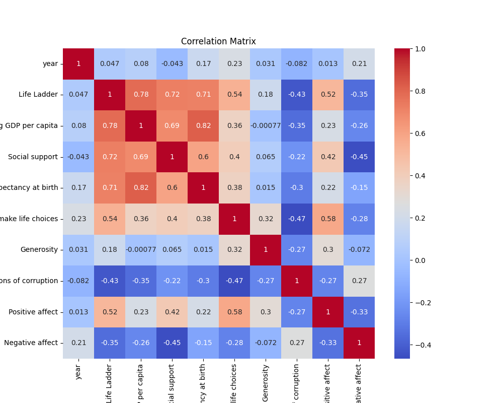

Once upon a time, in a world closely mirrored by ours, there existed a vibrant tapestry of nations, each woven with unique threads of life satisfaction, economic prowess, and social qualities. This tapestry spanned from the early days of 2005 to the more recent times of 2023, narrating a story of progress, challenges, and aspirations.

In the land of Life Ladder, the people measured their happiness on a scale from 0 to 10. With an average score of 5.48, the citizens generally found themselves moderately content, though their scores ranged dramatically from a quiet 1.28 to a jubilant 8.02. This suggested that while many were comparably satisfied, some lived in despair while others thrived in idyllic contentment. The balance was delicate, and the people reflected on how their life's quality could hover around the median of 5.45, suggesting their satisfaction was neither great nor poor, just simply balanced.

The wise economists of this tapestry chronicled Log GDP per Capita, the measure of their economic output. With a mean of 9.40, many nations flourished, but discrepancies were evident, stretching from a humble 5.53 to an impressive 11.68. A mere 28 tales of economic prosperity remained untold due to vanished records, yet the numbers spoke of varied fortunes and future potential for growth.

Social Support acted like an enduring beacon across the lands, its average score of 0.81 a testament to strong community ties. Whether in moments of great joy or sorrow, the citizens stood together with unwavering support, a steady force with little variation among them.

A spell of Healthy Life Expectancy at Birth painted scenes of promise and disparity. On average, lives extending to 63.4 years were celebrated, yet the abyssal gap between the shortest expectancy of 6.72 years and the longest of 74.6 years mirrored social inequities most feared by the people.

Freedom to Make Life Choices was a cherished value, and most citizens experienced moderate personal liberty, reflected in the average score of 0.75. Yet the variance from a scant 0.23 to near-complete freedom at 0.99 revealed that while many felt free, others found themselves shackled by invisible chains.

Generosity, a virtue much celebrated, was a curious tale. With scores hovering near zero and little variation, it spoke not of grand acts of kindness, but of a quiet neutrality where acts of giving were neither outstandingly common nor rare.

Meanwhile, Perceptions of Corruption cast long and dark shadows across the tapestry. With an average impression of 0.74, the stain of mistrust was ingrained deeply, though some narratives remained untold due to the 125 missing tales. This obscured their understanding, leaving portions of reality smudged and incomplete.

In an emotional spectrum, Positive and Negative Affect worked like colorful threads. Positivity reigned more dominantly with an average of 0.65, basking most of the populace in frequent joyful emotions, while negative emotions were less common, reflected by a lower mean of 0.27.

Across these nations and through these years, the intertwined stories showcased a world neither perfect nor tragic, but one full of dimensions of well-being, societal strengths, and lingering inequalities. A story where hope tangled with despair, where every citizen played their part in a narrative of continuous challenge and potential for triumph. This world’s tale, alongside its insights, urged its people to learn, to grow, and, most importantly, to weave a more harmonious future in the ever-evolving tapestry of humanity.

## Correlation Matrix
