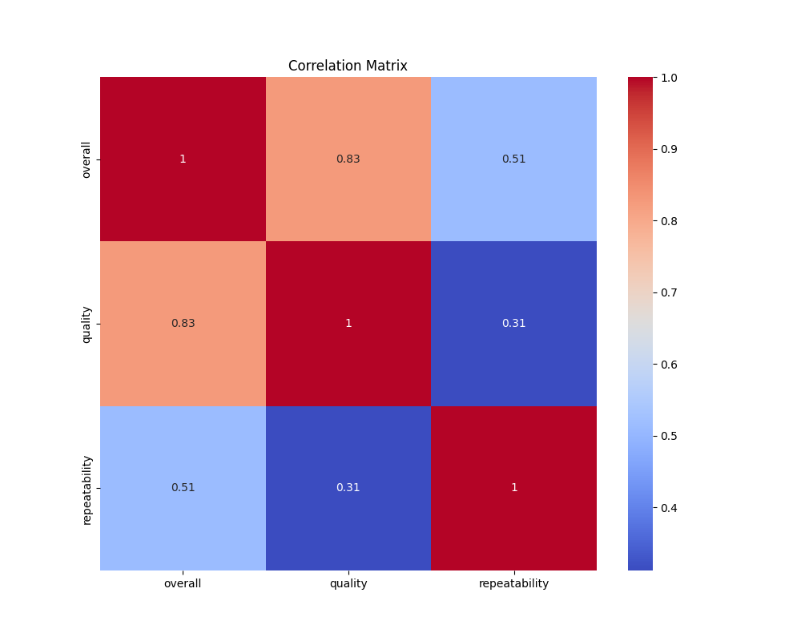

Once upon a time in a bustling market town was a small shop called "A Taste of Home." The shop was known for its unique, handcrafted goods, each item lovingly made by local artisans. The owner, Mr. Williams, prided himself on the quality of his offering, and many customers appreciated the charm and authenticity of the products.

One day, Mr. Williams decided to embark on a journey of discovery. Armed with a simple survey, he aimed to understand his customers better by collecting feedback on three key aspects: overall experience, quality of the goods, and the likelihood of customer return, or repeatability.

As Mr. Williams sat at his desk reviewing the feedback, a story began to unfold from the numbers before him. He leaned back, cup of coffee in hand, and considered what the data revealed.

First, he noticed there were no missing entries among the responses. This completeness reflected the loyalty and engagement of his customers, who took their time to provide feedback.

The mean ratings caught Mr. Williams's eye next. The overall experience was rated at an average of 3.05, a score slightly above neutral. The quality, on the other hand, was slightly better at an average of 3.21. Customers seemingly appreciated the products' quality even more than the general atmosphere or experience of shopping in the store.

However, it was the repeatability score, averaging at 1.49, that concerned Mr. Williams. This low score suggested that despite generally positive perceptions of quality and the overall experience, customers were not inclined to return as frequently. He pondered this anomaly, understanding it hinted at an area needing attention.

Mr. Williams delved deeper into the data's distribution. He observed that ratings for both overall experience and quality tended to cluster tightly around the median score of 3, with a standard deviation that suggested moderate variability. Yet despite the product quality's occasional higher score—with some customers rating it a 4—there was little variety in return intentions, which hovered around the low scores, typically ranging between 1 and 2.

The stark contrast between quality appreciation and poor repeatability was hard to ignore. Mr. Williams was determined to understand why a significant portion of his customers rated the quality highly but did not plan on returning.

Perhaps, he mused, his customers found the products excellent but believed them to be one-time purchases suited for special occasions, not day-to-day items. Or maybe, the overall shopping experience, though average, lacked an emotional draw or compelling reason to revisit.

Mr. Williams resolved to create a more inviting atmosphere and engage with his customers in new ways. He planned community events, hoping to build a sense of belonging and inspire regular visits. Special loyalty programs and seasonal product lines were also considered to enhance repeatability.

This tale of numbers told Mr. Williams a story not just of satisfaction but of an opportunity to weave "A Taste of Home" more deeply into the fabric of the town's community. As he closed his notebook with renewed purpose, Mr. Williams realized that insights weren't just numbers—they were doors opening to growth, connection, and success.

## Correlation Matrix
