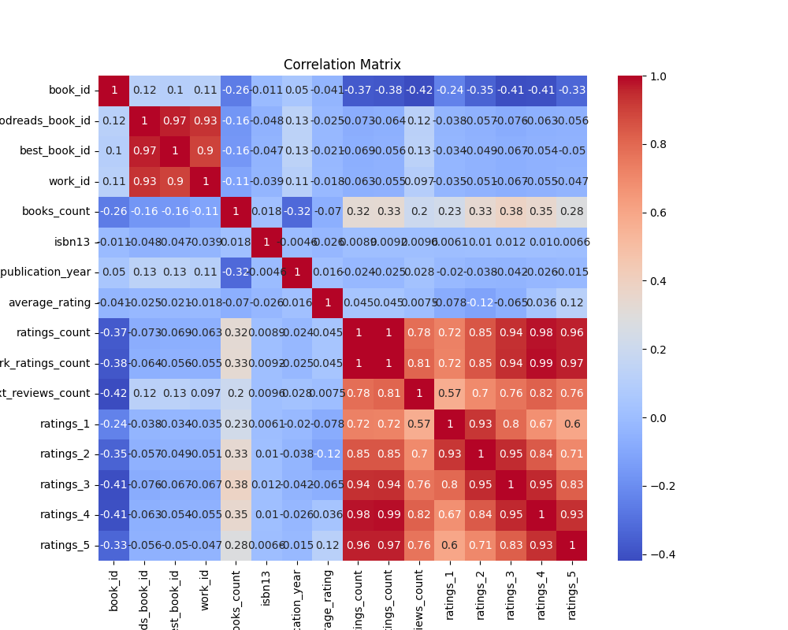

In the sprawling, digital universe of book lovers and bibliophiles, there exists a vast repository of knowledge — a dataset encapsulating the literary essence of 10,000 books. Within this mosaic, stories of popularity, acclaim, and obscurity unfold, painting a vivid picture of the reading world.

It was a dataset that brimmed with life like a bustling library, though with some gaps where stories whispered quieter than others. Missing bits of identity—the `isbn13` for 585 books and `original_publication_year` for 21—hinted at tomes that had perhaps lost their way through the annals of time or simply chose to remain mysterious, inviting readers to fill in the blanks with their imaginations.

A journey through the `original_publication_year` was like a voyage through time. The bulk of these literary pearls emerged between 1990 and 2011, as if the late 20th and early 21st centuries were golden epochs for storytelling. Yet, a curious outlier lurked, a book whispering its origins from the bewildering past of -1750. Was it a clerical error, a phantom of historical misreported lore, or perhaps a timeless piece that defied the ages?

The ambience of the collection was overwhelmingly warm, colored with an average rating around 4.00. It was a testament to a community predisposed to celebrate literature's gift, the self-selected few who often sought out luminary titles and rewarded them with stars aplenty. Yet, one couldn’t help but ponder the gentle bias of these high ratings—often, it seemed, the more acclaimed works caught more eyes and hearts.

Ratings and reviews told the story of popularity's spectrum. At one end, a singular tome stood proud, bathed in the glow of nearly 4.8 million individual ratings. It sat like a beacon, claiming the status of a literary idol. In its shadow, countless others clustered around the median—21,155—a humbler quorum of voices, each nuanced and personal. Text reviews echoed this pattern; some books ignited a constellation of discourse while others whispered their tales to just a few.

Delving into the multiverse of editions revealed a spectrum as diverse as the stories themselves. Some titles existed in many forms like well-adapted plays with each edition catering to a different audience, while others were encapsulated within a solitary edition, a singular frame for the narrative they housed.

Within this dataset lay the story of literature as both a shared and disparate experience—a tapestry woven from countless individual threads, resilient in their broad array of variance. Some threads gleamed prominently, reflecting the mass attention of the present age, while others were subtler, meant for the discerning few who paused to discover hidden gems.

And so, the dataset stood, a monumental reflection of literary culture—a mirror to past and present, a collection of tales told and retold, bathed in the glow of reader appreciation, yet open and awaiting new authors and stories to expand its ever-growing horizon.

## Correlation Matrix
